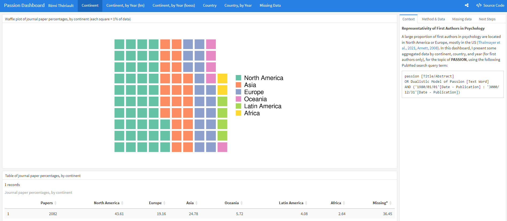

<!-- README.md is generated from README.Rmd. Please edit that file -->

```{r, include = FALSE}
knitr::opts_chunk$set(
  collapse = TRUE,
  comment = "#>",
  fig.path = "man/figures/README-",
  out.width = "100%"
)
```

# pubDashboard: Creating Publication Data Visualization Dashboards 

<!-- badges: start -->
[](https://github.com/rempsyc/pubDashboard/actions)
[](https://rempsyc.r-universe.dev/ui/#package:pubDashboard)
[](https://CRAN.R-project.org/package=pubDashboard)
[](https://github.com/rempsyc/pubDashboard/commits/main)
[](https://lifecycle.r-lib.org/articles/stages.html#experimental)
[](https://github.com/sponsors/rempsyc)
[](https://github.com/rempsyc?tab=followers)
[](https://github.com/rempsyc/pubDashboard/stargazers)
<!-- badges: end -->

The goal of `pubDashboard` is to facilitate the creation of pretty data visualization dashboards using the `flexdashboard` and `openalexR` packages.

## Installation

You can install the development version of `pubDashboard` like so:

``` r
# If `remotes` isn't installed, use `install.packages("remotes")`
remotes::install_github("rempsyc/pubDashboard")
```

## Example Dashboards

The full source-code for these dashboards are available on the corresponding button at the top-right of each dashboard.

### Neglected 95% Dashboard

[](https://remi-theriault.com/dashboards/neglected_95)

### Passion Dashboard

[](https://remi-theriault.com/dashboards/passion)
