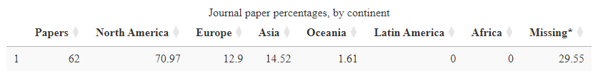

<!-- README.md is generated from README.Rmd. Please edit that file -->

# pubDashboard: Creating Publication Data Visualization Dashboards 

<!-- badges: start -->

[](https://github.com/rempsyc/pubDashboard/actions)
[](https://rempsyc.r-universe.dev/ui/#package:pubDashboard)
[](https://CRAN.R-project.org/package=pubDashboard)
[](https://github.com/rempsyc/pubDashboard/commits/main)
[](https://lifecycle.r-lib.org/articles/stages.html#experimental)
[](https://github.com/sponsors/rempsyc)
[](https://github.com/rempsyc?tab=followers)
[](https://github.com/rempsyc/pubDashboard/stargazers)
<!-- badges: end -->

The goal of `pubDashboard` is to facilitate the creation of pretty
data visualization dashboards using the `flexdashboard` and `easyPubMed`
packages.

## Installation

You can install the development version of `pubDashboard` like so:

``` r
# If `remotes` isn't installed, use `install.packages("remotes")`
remotes::install_github("rempsyc/pubDashboard")
```

## Basic Examples

`pubDashboard` helps parse the address to identify department and
university of affiliation, as well as country.

``` r
library(pubDashboard)

address <- c(
  "Department of Psychology, Cornell University, Ithaca, New York 14853-7601.",
  "Dipartimento di Psicologia Generale, Università di Padova, Italy.",
  "Universität Mannheim, Federal Republic of Germany.",
  "Département de psychologie, Université du Québec à Montréal, Canada."
)

get_affiliation(address, "department")
#> [1] "Department of Psychology"            "Dipartimento di Psicologia Generale"
#> [3] NA                                    "Département de psychologie"

get_affiliation(address, "university")
#> [1] "Cornell University"              "Università di Padova"           
#> [3] "Universität Mannheim"            "Université du Québec à Montréal"

get_country(address)
#> [1] "United States" "Italy"         "Germany"       "Canada"
```

## Mega Function

One simple function allows to download the paper data from PubMed,
convert the XLM data to a dataframe, extract affiliations, match
universities to countries, identify countries and continents, and save
the file to disk for later reuse.

``` r
save_process_pubmed_batch(
  pubmed_query_string = "passion [Title/Abstract]",
  journal = c("Journal of Personality and Social Psychology", "Health Psychology"),
  year_low = 2023,
  year_high = 2030
)
#> pubmed_query_string =
#>  passion [Title/Abstract] AND Journal of Personality and Social Psychology [Journal] 
#>  OR Health Psychology [Journal] AND ('2023/01/01' [Date - Publication] : '2030/12/31'
#>  [Date - Publication]) 
#>  1/5 - Downloading PubMed data... [10:34:20 AM]
#> [1] "PubMed data batch 1 / 1 downloaded..."
#> 2/5 - Converting XLM files to dataframe... [10:34:23 AM]
#> 3/5 - Extracting affiliations... [10:34:40 AM]
#> 4/5 - Matching universities to countries... [10:34:40 AM]
#> 5/5 - Identifying countries and continents... [10:34:44 AM]
#> Operation successfully completed. Congratulations! [10:34:59 AM]
#>  File saved in data/articles_2023_2030.rds
```

## Table formatting functions

Various functions allow to prepare DT tables to display specific
information, such as journal paper percentages by continent or country.

``` r
data <- read_bind_all_data()
```

``` r
table_continent(data)
```



## Figure formatting functions

``` r
waffle_country(data)
```


## Example Dashboards

The full source-code for these dashboards are available on the
corresponding button at the top-right of each dashboard.

### Neglected 95% Dashboard

[](https://remi-theriault.com/dashboards/neglected_95)

### Passion Dashboard

[](https://remi-theriault.com/dashboards/passion)
