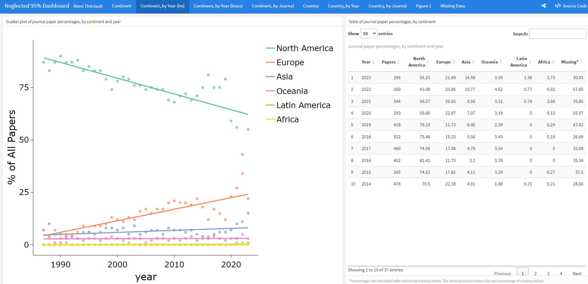
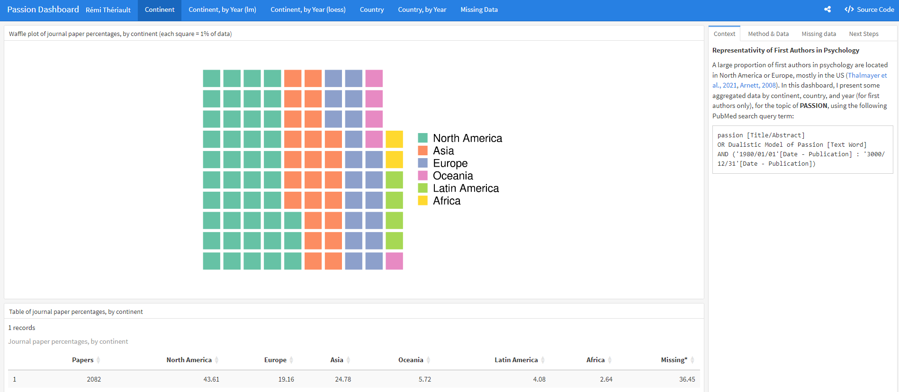

# pubDashboard: Creating Publication Data Visualization Dashboards

The goal of `pubDashboard` is to facilitate the creation of pretty data
visualization dashboards using the `flexdashboard` and `openalexR`
packages.

## Installation

You can install the development version of `pubDashboard` like so:

``` r
# If `remotes` isn't installed, use `install.packages("remotes")`
remotes::install_github("rempsyc/pubDashboard")
```

## Example Dashboards

The full source-code for these dashboards are available on the
corresponding button at the top-right of each dashboard.

### Neglected 95% Dashboard

[](https://remi-theriault.com/dashboards/neglected_95)

### Passion Dashboard

[](https://remi-theriault.com/dashboards/passion)
